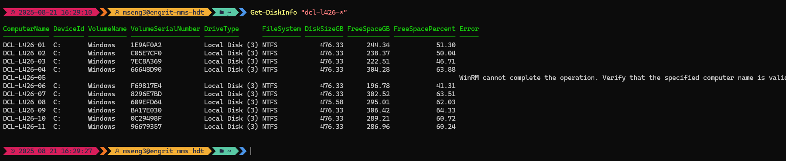

# Summary
Returns information about the disk size and free space from a list of remote computers.  

It calculates percent free space, and outputs the data in a convenient table to the screen. It also optionally outputs a proper PowerSHell object, and/or a CSV file and a log.  

It's intended for a fast glance at disk space health of multiple machines. It's very fast, except when it tries to contact machines which don't respond.  

This is a more PowerShell-idiomatic re-write of [Get-DiskSpace](https://github.com/engrit-illinois/Get-DiskSpace). It adds support for returning data about multiple disks and volumes from individual computers, but it drops support for logging and custom highlighting of low-diskspace results.  

# Requirements
PowerShell 7+ due to the use of `ForEach-Object -Parallel`.  

# Usage
1. Download `Get-DiskInfo.psm1` to the appropriate subdirectory of your PowerShell [modules directory](https://github.com/engrit-illinois/how-to-install-a-custom-powershell-module).
2. Run it using the examples and parameter documentation below.

# Examples
- `Get-DiskInfo "espl-114-01"`
- `Get-DiskInfo "espl-114-01","espl-114-02","tb-207-01"`
- `Get-DiskInfo "espl-114-*"`
- `Get-DiskInfo "espl-114-*","tb-207-01","tb-306-*"`

# Example output:

# Parameters

### -ComputerName [string[]]
Required string array.  
The list of computer names and/or computer name query strings to poll for disk space data.  
Use an asterisk (`*`) as a wildcard.  
The parameter name may be omitted if the value is given as the first or only parameter.  

### -SearchBase [string]
Optional string.  
The OU distinguished name of the OU to limit the computername search to.  

### -ThrottleLimit [int]
Optional integer.  
The maximum number of computers poll in parallel simultaneously.  
Default is `50`.  

### -OperationTimeoutSec [int]
Optional integer.  
The maximum number of seconds to wait for an individual computer to respond before giving up.  
Default is `10`.  

### -PassThru
Optional switch.  
If specified, the results are also returned as a PowerShell object.  

### -DisablePsVersionCheck
Optional switch.  
By default the module throws an error when run on version of PowerShell lower than 7.x.  
If specified, this check is skipped.  

# Notes
- If run in a host that supports color coding (i.e. the default Powershell console), the values in the `Free space (%)` column will be colored according to the "Percent" parameters above. This is useful for quick scanning of results from many computers.
- By mseng3. See my other projects here: https://github.com/mmseng/code-compendium.
